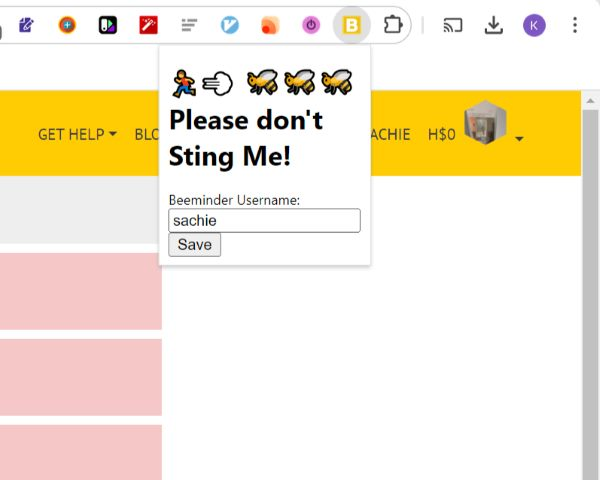

## Simple Beeminder Extension 🏃💨 🐝🐝🐝

Simple Beeminder is a chrome extension that provides a streamlined interface for easy data input on Beeminder.  

  
  
  
## Installation

1. Download the extension from the GitHub releases page.
2. Open Chrome and go to `chrome://extensions/`.
3. Enable Developer Mode in the top right corner.
4. Drag and drop the downloaded extension file (.zip) onto the extensions page.
5. The Simple Beeminder extension should now appear in your Chrome toolbar.

## Usage

1. Click on the Simple Beeminder extension icon in your Chrome toolbar.
2. Enter your Beeminder username in the popup window.
3. Click "Save" to apply the username.
4. Navigate to `https://www.beeminder.com/username` (replace "username" with your Beeminder username).
5. The extension will automatically optimize the layout for data input on your Beeminder page.
6. Use the simplified input form to update your progress and add comments to your goals.

**Note:** This extension is specifically designed for Chrome. It is not tested on other browsers.

